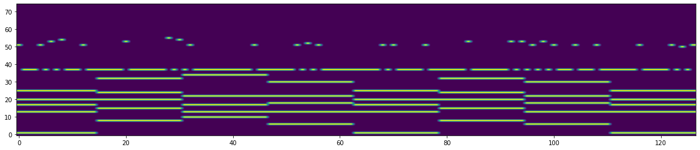
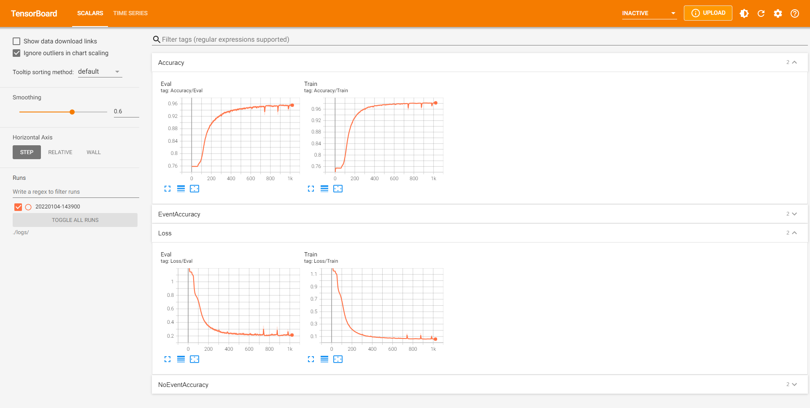

# Pytorch Implementation of Improv RNN

## Overview

This code is a pytorch implementation of the popular [Improv RNN](https://github.com/magenta/magenta/tree/main/magenta/models/improv_rnn) model originally implemented by the Magenta team. The model is able to generate melodies conditioned on a given chord progression.<br/>
The specific model implemented in this repository is the Chord Pitches Improv model which encodes chords as the concatenation of the following length-12 vectors:

* a one-hot encoding of the chord root pitch class, e.g. `[0, 0, 1, 0, 0, 0, 0, 0, 0, 0, 0, 0]` for a D major (or minor, etc.) chord
* a binary vector indicating presence or absence of each pitch class, e.g. `[1, 0, 0, 1, 1, 0, 0, 1, 0, 0, 1, 0]` for a C7#9 chord
* a one-hot encoding of the chord bass pitch class, which is usually the same as the chord root pitch class except in the case of "slash chords" like C/E

You can either use a pre-trained checkpoint of the model or train your own using the steps below.

## Installation

### Install Required Libraries

```
pip install -r requirements.txt
```

## Generate a Melody Given Backing Chords

A pretrained checkpoint of the model can be found in the "checkpoints" folder. The checkpoint has been trained for 1000 epochs on the OpenEWLD dataset.

```
python 003_generate_melody.py --backing_chords "C G Am F C G F C" --output out.mid
```

This will generate a melody starting with a middle C over the chord progression C G Am F C G F C, where each chord lasts one bar. You can modify the backing chords as you like using the *backing_chords* parameter. You can define where the generated midi file should be saved with the *output* parameter.

An example of the generated RNN features is visualized here:



## Train Your Own Model

### Download OpenEWLD Dataset

To train the model, the [OpenEWLD dataset](https://framagit.org/sapo/OpenEWLD) is used. OpenEWLD is a subset of the Wikifonia Leadsheet Dataset reduced to only copyright free songs. A lead sheet is a musical score that contains a notation of the melody and the underlying chord progression of a song.<br/>
The song examples are in the compressed musicxml (\*.MXL) format which can be parsed in to sequences of note events using the [note-seq](https://github.com/magenta/note-seq) library.

### Dataset Preparation

Extract features from musicxml files and store them in a h5 file.
```
python 001_create_dataset.py --input C:/Datasets/OpenEWLD/dataset
```

### Training

Track metrics using Tensorboard
```
python 002_train.py --num_epochs 1000
```

Track metrics using Tensorboard
```
tensorboard --logdir ./logs/
```

The curves of the loss and accuracy over the training epochs are shown in tensorboard:


